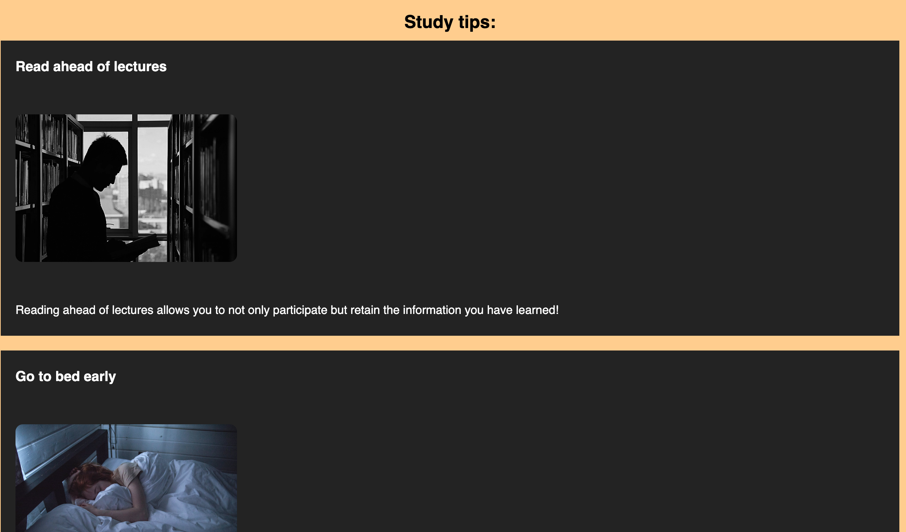

## Study Tips
Welcome to my website full of study tips:
 It is a website designed for students to discover new ways to invigorate their productive minds
 ot is meant for university students.

## Features

### Navigation Bar

The Navigation bar is featured on each page (home, study tips and signup). 

### Footer Section

The footer section contains links to facebook and twitter. The purpose of this feature is to have the user follow the company (amateur art) on our social platforms and be informed on updates that could be relevant to them. 

### Home Section

The homepage features text to welcome the user to the website and states who it is intended for. Features a background image of a school

### Study Tips Section

Features a list of study tips

### Signup Section

Features an email input that allows users to add their email to receive a newsletter

## Testing 

### Validator Testing 

- HTML
  - No errors were returned when passing through the official [W3C validator](https://validator.w3.org/nu/)
- CSS
  - No errors were found when passing through the official [(Jigsaw) validator](https://jigsaw.w3.org/css-validator/validator)
- Screen compatibility 
    - I have checked that the screen compatibility using the website, 'AM I RESPONSIVE?' [website](https://ui.dev/amiresponsive?url=https://8000-rawaspec-amateurart-n1twbn3zboq.ws-eu81.gitpod.io/home.html).
- Performance
    - The site performace was tested on lighthouse.[website]
    

### Bugs
 I have faced problems with the terminal multiple times but then I reviewed the course again on the command-line interface area to achieve a better understanding and resolve the issues.

## Deployment procedure

The application is deployed by configuring github to use the main branch for a github pages site.

## Credits

### Images
The images were found on [google](https://google.com) and pexels.com. Fonts are from fontawesome

